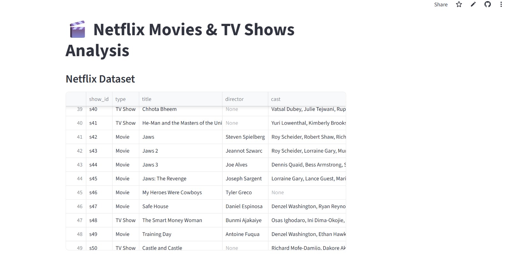

# Netflix Movies & TV Shows Analysis
## Dashboard Screenshot

## Project Overview

This project analyzes Netflix movies and TV shows data.

The aim of this project is to find useful insights about:
- Movies and TV Shows
- Popular genres
- Countries
- Ratings
- Release years
- Content duration

## Technologies Used

- Python
- Pandas
- NumPy
- Matplotlib
- Seaborn
- Streamlit

## Features

- Data cleaning
- Exploratory Data Analysis
- Interactive dashboard
- Charts and visualizations
- Filtering options

## Dataset

Dataset used:
Netflix Movies and TV Shows Dataset

## Live Demo

Add your Streamlit website link here:

https://your-project-name.streamlit.app

